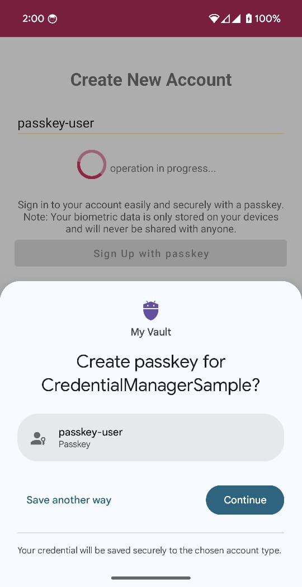
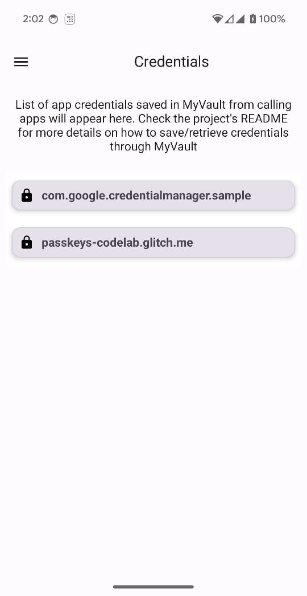
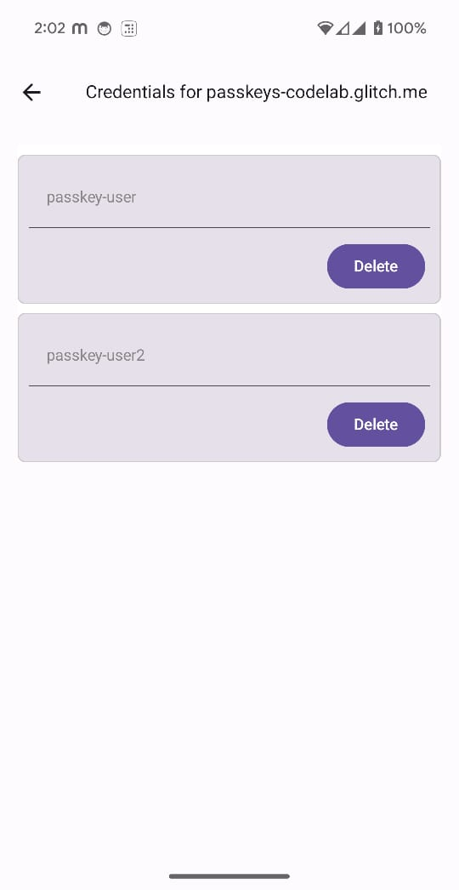
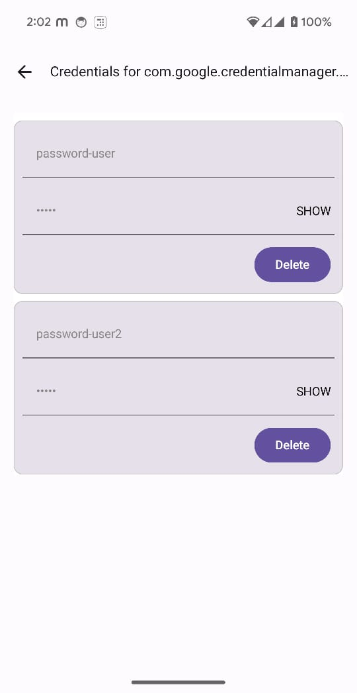
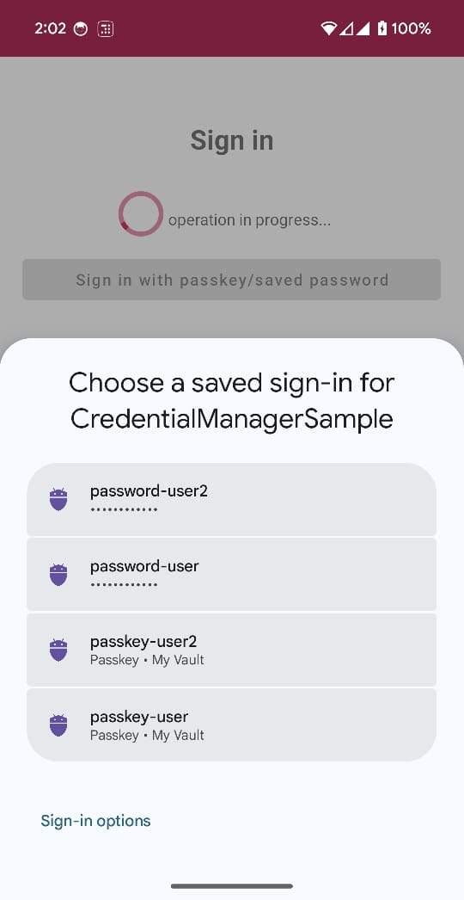

MyVault App
==================

This is a sample app which allows users to save, view and use their login credentials for websites and other apps. It's a credential provider app which saves passkeys and passwords.

The app demonstrates how to use the [Jetpack Credential Manager API](https://developer.android.com/jetpack/androidx/releases/credentials).
It provides a reference implementation of the [Credential Manager guidance](https://developer.android.com/training/sign-in/credential-provider)
for developers wishing to create a credential provider app.

# Features

The app demonstrates how to:

- Register as a `CredentialProviderService` so that users can store and retrieve passwords and passkeys using the app.
- Save passwords/passkeys to the app. These are stored locally in a database for demonstration purposes only. In a real app this data should be sent to a server to allow the user's credentials to be synchronized across all their devices.
- Retrieve credentials from the app to assist with user login in another app or website.
- Implement your own biometric prompts for single-tap credential creation and sign-in.
- Delete passkeys or passwords.

# Requirements

- Latest [Android Studio stable release](https://developer.android.com/studio)
- An Android device or emulator running Android 14 or higher.
- Up-to-date Google Play Services (GMS version should be above 230815045).

# Using the app

## Set MyVault as a credential provider
The MyVault app must be selected as a credential provider on the Android device before any credentials from other apps can be saved.

- Ensure that a screen lock mechanism (e.g. a PIN) has been set
- Build and run the MyVault app
- Go to Android device settings -> Passwords and accounts
- Under the "Additional providers" section, enable MyVault as a provider

Now, whenever you create a new passkey or password in an app that supports the CredentialManager API, you will be prompted to save it in the MyVault app.

## Create a credential in another app
- Build and run the [Credential Manager app](../CredentialManager) also in this code repository
- Choose "Sign up"
- Enter a username
- Choose "Sign up with passkey"

This will create a passkey for the Credential Manager app and store it in the MyVault app.

Note: You can use any app which supports passkey creation, just ensure that you choose "MyVault" as the destination for the passkey.

## View and delete credentials
- Run the MyVault app to see the passkeys and passwords which have been saved to the MyVault app
- To delete all credentials, open the app drawer -> Settings -> Delete all data

                               
 

## Retrieve a credential in another app
- Run the [Credential Manager app](../CredentialManager)
- Choose "Sign in"
- Choose the previously entered username

# Understanding the app
This app follows the [official Credential Manager guidance](https://developer.android.com/training/sign-in/credential-provider).
Please read that first to understand how the app has been implemented.

## Project structure
Here are the folders in the project and what they contain:

- `<root>` - Application and app dependencies.
- `data` - Repository, database and service classes. Key classes are `CredentialsRepository` and `MyVaultService`.
- `fido` - Classes for parsing responses according to FIDO guidelines. This implementation
  is for demonstration purposes only and should not be used directly in production. Refer to the
  official WebAuthn specs [here](https://www.w3.org/TR/webauthn-2).
- `ui` - Activities for handling requests from other apps. Screens and UI elements (written using Compose).

## Key classes

### Credential provider service
`MyVaultService` subclasses [`CredentialProviderService`](https://developer.android.com/reference/androidx/credentials/provider/CredentialProviderService) and responds to requests from the Credential Manager API, such as when creating or reading a passkey.

Each `onBegin` method responds with an entry which will be shown on the account selector, allowing the user to choose one of those entries.

Each entry also has a `PendingIntent` which will be called when the user selects that entry.

This is the first phase in the [two-phased approach to provider interaction](https://developer.android.com/training/sign-in/credential-provider#two-phased-approach).

### Activities

This project contains 6 activities - `MainActivity` for the main app UI, plus 5 additional activities to handle the `PendingIntents` created when responding to Credential Manager API calls in `MyVaultService`. The second phase in the [two-phased approach to provider interaction](https://developer.android.com/training/sign-in/credential-provider#two-phased-approach).

These additional activities are described below.

- `CreatePasskeyActivity`: Creates a passkey
- `GetPasskeyActivity`: Gets a passkey
- `CreatePasswordActivity`: Creates a password
- `GetPasswordActivity`: Gets a password
- `UnlockActivity`: Unlocks the requested credential by surfacing a biometric authentication flow

### Data classes
- `CredentialRepository` - contains the logic for creating, storing and reading credentials.
- `CredentialsDataSource` - CRUD operations for credentials, backed by a Room DAO.

For more detailed information on how to create, save and retrieve credentials using the Credential Manager API, refer to the [official documentation]((https://developer.android.com/training/sign-in/credential-provider))

To implement your own biometrics prompt, refer to the [biometrics documentation](https://developer.android.com/identity/sign-in/single-tap-biometric)

## License

The **MyVault Sample** is distributed under the terms of the Apache License (Version 2.0).
See the [LICENSE](/LICENSE) file for more information.
